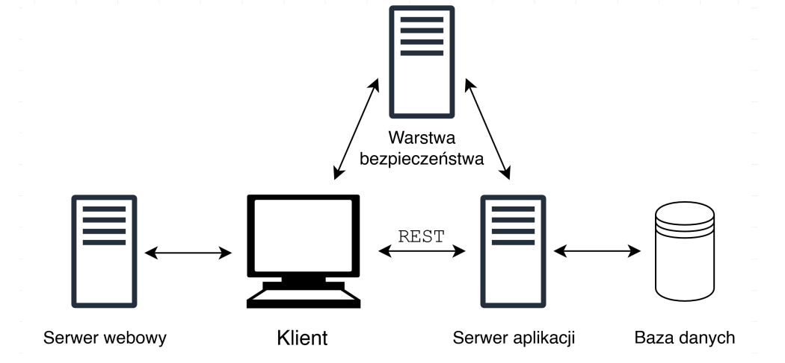
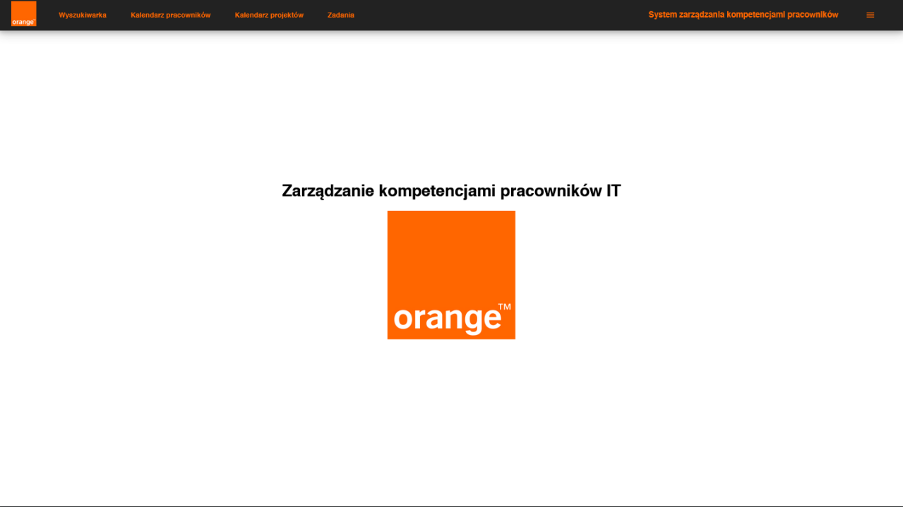
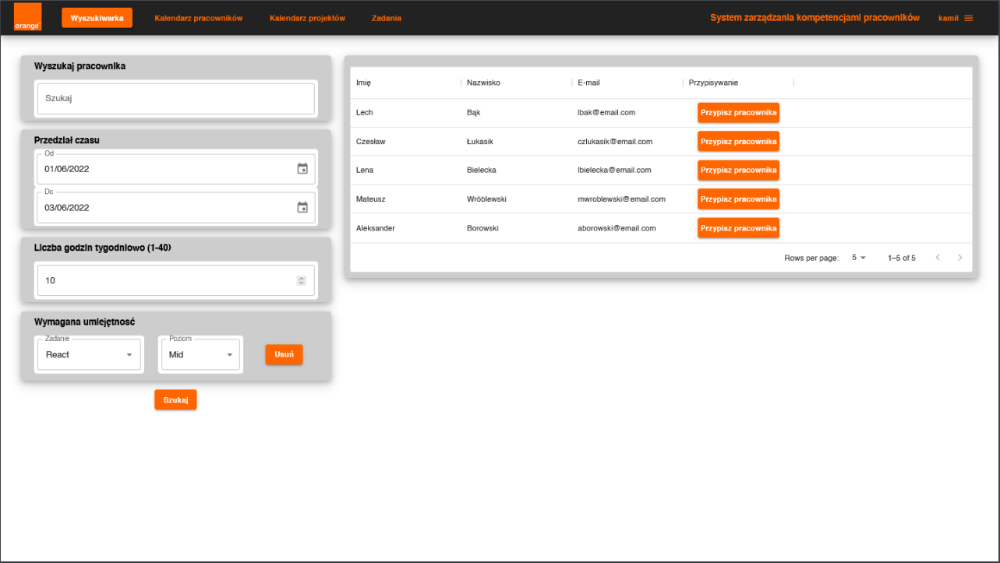
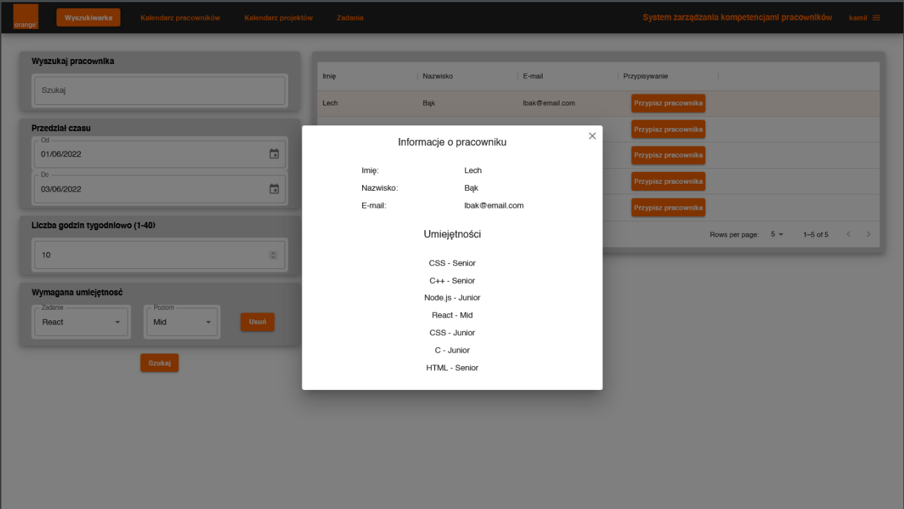
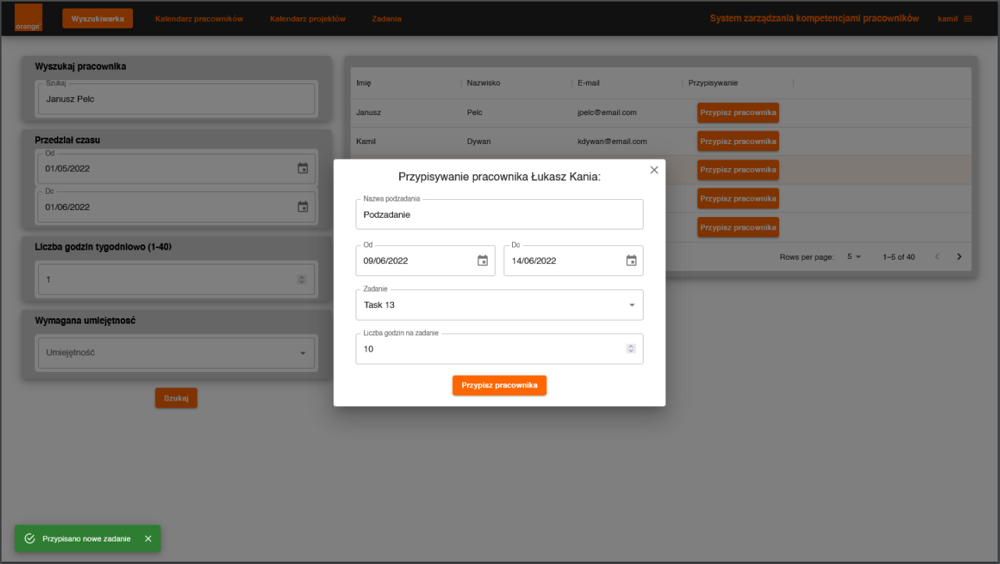
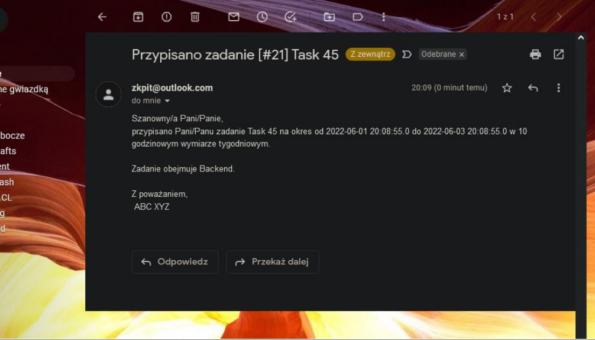
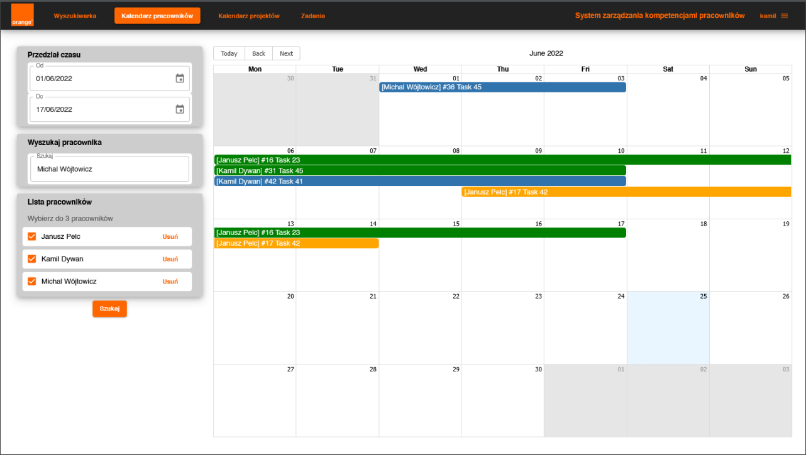
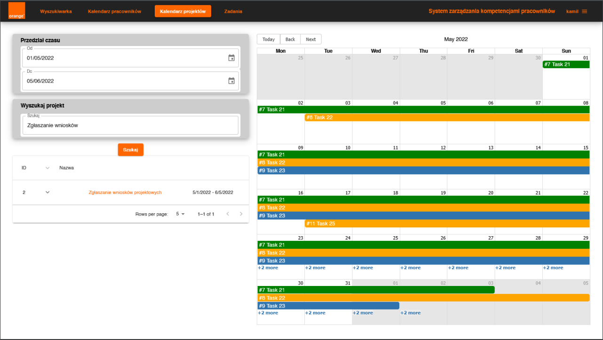
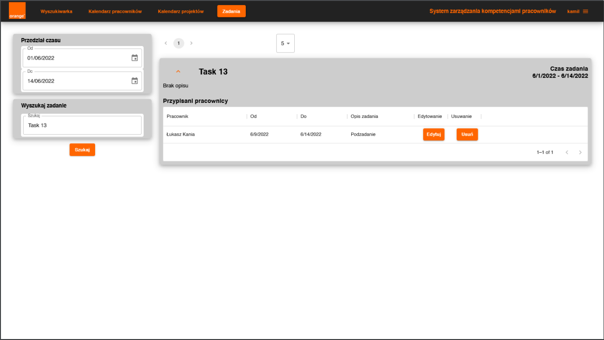
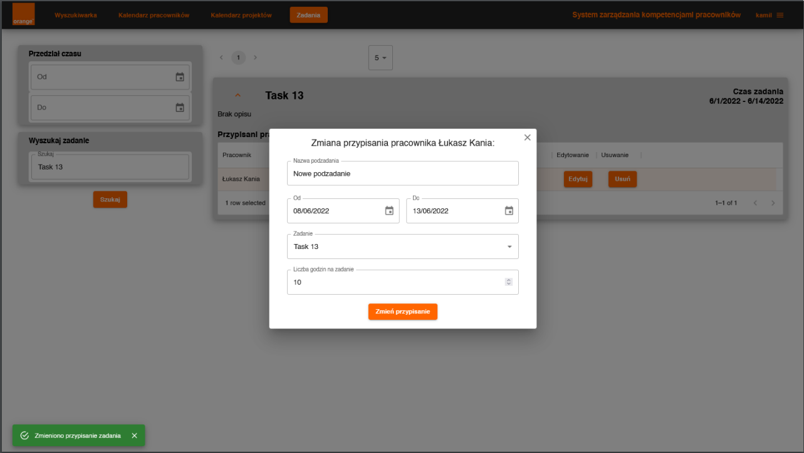

# Zarządzanie kompetencjami pracowników IT (06.2022)
Aplikacja umożliwia przełożonemu przydzielanie zadań do osób posiadających odpowiednie kompetencje i zarządzanie ich czasem spędzanym nad projektami. Aplikacja została zrealizowana w ramach projektu zespołowego na Politechnice Wrocławskiej. Temat został zaproponowany przez firmę Orange i później też w trakcie realizacji tego projektu współpracowaliśmy z tą firmą w ramach co tygodniowych spotkań. Podczas spotkań prezentowaliśmy postępy prac nad projektem, w razie problemów mogliśmy liczyć na wsparcie przedstawicieli z firmy oraz na bieżąco otrzymywaliśmy wskazówki oraz sugestie. Oprócz tematu otrzymaliśmy również listę wymagań oraz proponowane technologie. Realizowana przez nas aplikacja miała być częścią większego systemu składającego się jeszcze z mobilnej giełdy projektów oraz systemu zgłaszania wniosków projektowych. Niestety z powodu braku wystarczającego czasu, ostatecznie nie udało się przeprowadzić integracji systemów.

Zgłosiliśmy aplikację na konferencję projektów zespołowych 2022 Politechniki Wrocławskiej, gdzie m.in. zaprezentowaliśmy nasz produkt przed publicznością. Na końcu konferencji odbyło się głosowanie na najlepszy projekt i mimo iż nie udało się zwyciężyć, to kilku firmom spodobał się nasz projekt.

Link do filmu demonstrującego działanie aplikacji: https://drive.google.com/file/d/1STox64zxTvBYRx1qQMhokqsFA-oaV4dU/view?usp=sharing

Kod aplikacji jest własnością firmy Orange.

## Wymagania funkcjonalne:
* Wyszukiwanie pracowników według:
    * posiadanych umiejętności,
    * dostępnego przedziału czasowego,
    * ilości dostępnych godzin.
* Przypisywanie pracowników do zadań w ramach projektów,
* Kalendarz pracowników - wyświetlenie zadań przypisanych do wybranych pracowników z podanego przedziału czasowego,
* Kalendarz projektów:
    * Wyszukiwanie projektów według nazwy i czasu trwania,
    * Wyświetlanie zadań przypisanych do konkretnych projektów.
* Zadania:
    * Wyszukiwanie zadań według nazwy i czasu trwania,
    * Sprawdzanie pracowników przypisanych do danego zadania,
    * Edytowanie i usuwanie przypisanych zadań.

## Architektura systemu:

    

## Technologie:
* Frontend:
    * Biblioteka do tworzenia UI - React (JavaScript),
    * Statyczne typowanie - TypeScript,
    * Biblioteka komponentów - MUI.
* Backend:
    * Główny język - Java,
    * Framework - Spring / Spring Boot (Java).
* Baza danych - PostgreSQL,
* Warstwa bezpieczeństwa - Keycloak,
* Wdrożenie:
    * Konteneryzacja aplikacji - Docker,
    * Serwer webowy - Nginx,
    * Baza danych - Azure,
    * Reszta aplikacji - Google Cloud Platform.

## Widoki aplikacji:
Strona główna:

    

Wyszukiwanie pracowników:

    

Informacje szczegółowe o pracowniku:

    

Przypisanie pracownika do zadania:

    

Powiadomienie o przypisanym zadaniu wysłane na skrzynkę pocztową:

    

Kalendarz pracowników:

    

Kalendarz projektów:

    

Zadania:

    

Edytowanie przypisania zadania:

    

